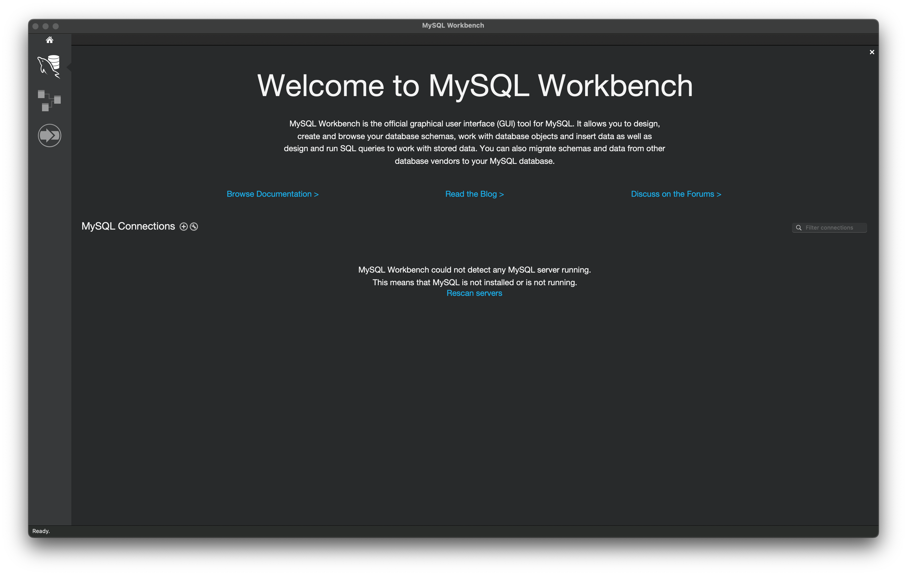

# Lab03 - Create and Access database on MySQL Docker Container

Reference:
* https://dev.mysql.com/doc/refman/8.4/en/creating-database.html
* https://phoenixnap.com/kb/how-to-create-a-table-in-mysql

## Step 1:
Install Client GUI Tool to access Database 

* MySQL WorkBench: https://dev.mysql.com/downloads/workbench/
* Azure Data Studio: https://learn.microsoft.com/en-us/azure-data-studio/download-azure-data-studio?view=sql-server-ver16&tabs=win-install%2Cwin-user-install%2Credhat-install%2Cwindows-uninstall%2Credhat-uninstall#download-azure-data-studio

  * Install Extension: 
    * MySQL
    * SQL Database Project

## Step 2:

Connect to Database with Terminal

### Step 2.1:

Start MySQL Docker Container

```shell
docker container start db-mysql
```
Check status of MySQL Docker Container

```shell
docker ps
```

### Step 2.2:
Access to MySQL Docker Container

```shell
docke exec -it db-mysql bash
```

### Step 2.3:
Connect to Database on MySQL Docker Container

```shell
mysql -u db_user -p
```

## Step 3:
Create Database with command

```sql
CREATE {DATABASE | SCHEMA} [IF NOT EXISTS] db_name
    [create_option] ...

create_option: [DEFAULT] {
    CHARACTER SET [=] charset_name
  | COLLATE [=] collation_name
  | ENCRYPTION [=] {'Y' | 'N'}
}
```

and now, we create databse ***db-product*** with command

```sql
CREATE DATABASE IF NOT EXISTS db_product
CHARACTER SET utf16
COLLATE utf16_unicode_ci;
```

Use database
```sql
use db_product;
```

Show current database:
```sql
SELECT DATABASE();
```

and drop database with command:
```sql
DROP DATABASE db_product;
```
Show all databases:
```sql
SHOW DATABASES;
```

## Step 04:
Create new table with foreign key

* Set default storage engine for current secion

```sql
SET default_storage_engine = InnoDB;
```

* Create categories table

```sql
CREATE TABLE IF NOT EXISTS tb_categories(
  id INT AUTO_INCREMENT PRIMARY KEY,
  name VARCHAR(50) NOT NULL
) CHARACTER SET utf16 COLLATE utf16_unicode_ci ENGINE=InnoDB;
```

or 

```sql
CREATE TABLE IF NOT EXISTS tb_categories(
  id INT AUTO_INCREMENT,
  name VARCHAR(50) NOT NULL,
  PRIMARY KEY (id)
) CHARACTER SET utf16 COLLATE utf16_unicode_ci ENGINE=InnoDB;
```

* Create ***tb_products*** table have foreign key to reference to id of tb_categories

```sql
CREATE TABLE IF NOT EXISTS tb_products(
  id INT AUTO_INCREMENT NOT NULL,
  name VARCHAR(100) NOT NULL,
  price INT NOT NULL,
  cat_id INT NOT NULL, 
  PRIMARY KEY (id),
  FOREIGN KEY (cat_id) 
    REFERENCES tb_categories(id) 
    ON UPDATE CASCADE 
    ON DELETE RESTRICT
) CHARACTER SET utf16 COLLATE utf16_unicode_ci ENGINE=InnoDB;
```

* Show table

```sql
SHOW tables;
```

* Using __DESCRIBE__ command to show table structure

```sql
DESCRIBE table_name
```

## Step 05:
Using GUI Client tool to access to MySQL Docker Container Database

### 5.1 - MySQL Workbench

Download MySQL Workbench: [click here to download](https://dev.mysql.com/downloads/workbench/)



* Create connection to database with MySQL Workbench


Click Test Connection Button to test


Click OK button to save the connection

* Connect to Database (database schema db_product)

Click to connection with the created in above step to connect database


* Using MySQL Work to access Database(database schema db_product)

Create query to access database 


* Create EER model (Database Diagram) with MySQL Workbench

Create EER model from Database


Using connection which is create to connect database 


Choose Database to create EER model

***Continue*** button to move to next step


Click ***Continue*** button to end step

***The EER is the same as below picture***


