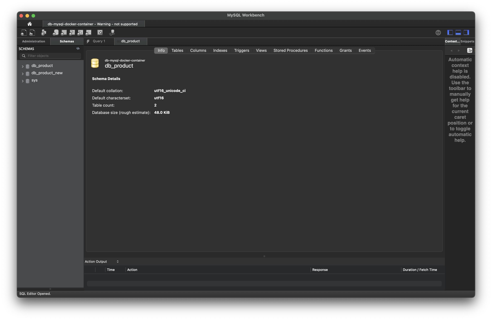
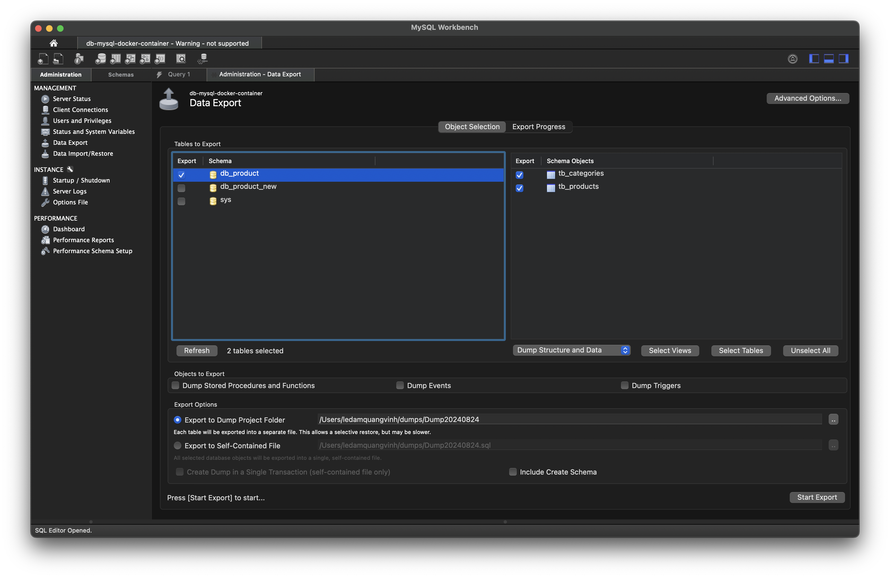
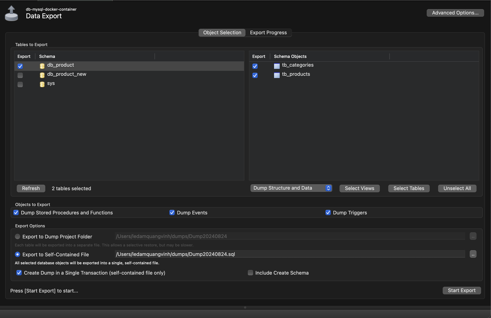
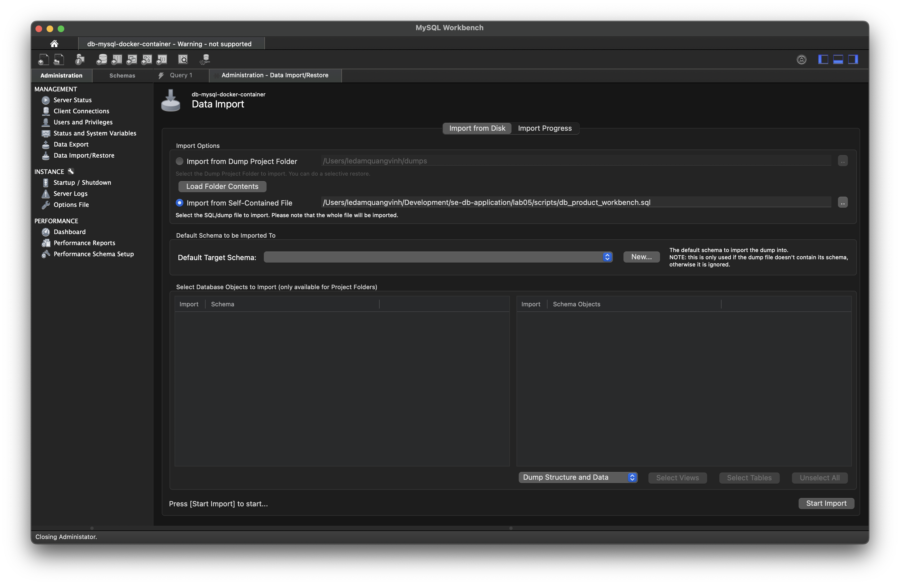

# Export and Import data

## 1 - Using Terminal 
### 1.1 - Export Database
* Connect to MySQL Docker Container
```shell
docker exec -it db-mysql bash
```

* Navigate to directory ***/var/lib/mysql*** (docker volume mapping)
```shell
cd /var/lib/mysql
```

* Dump Database to Script SQL file with name db_product_script.sql 
```shell
mysqldump -u root -p db_product > db_product_script.sql
```
* Copy file script file ***db_product_script.sql*** from docker volume or docker container ***db-mysql-new-data*** to host (PC)

```shell
docker cp db-mysql:/var/lib/mysql/db_product_script.sql ./scripts/db_product_script.sql
```

### 1.2 - Import Database
* Duplicate script file db_product_script.sql to db_product_new.sql

* Copy file ***db_product_new.sql*** to docker volme (MySQL Docker Container) ***var/lib/mysql
```shell
docker cp ./script/db_product_new.sql db-mysql:/var/lib/mysql/
```

* In MySQL Docker Container, ***CREATE DATABASE*** with database name ***db_product_new*** 

```sql
CREATE DATABASE IF NOT EXISTS `db_product_new`
CHARACTER SET utf16
COLLATE utf16_unicode_ci;
```

* In MySQL Docker Container, execute ***db_product_new.sql*** to import data to ***db_product_name***

```shell
mysql -u root -p db_product_new < ./var/lib/mysql/db_product_new.sql
```

* Connect to Database to check data after import 
```shell
mysql -u root -p 
```

input password (***admin123***)

* Show all database
```sql
show databases;
```

* Set ***db_product_new*** working database
```sql
USE db_product_new;
```

* Show all tables in database ***db_product_new***

```sql
SHOW TABLES;
```

* Execute query to check data
```sql
SELECT p.id, p.name, p.price, c.name
FROM tb_products p
LEFT JOIN tb_categories c
ON p.cat_id = c.id;
```

## 2 - Using GUI Test

### 2.1 - Using MySQL Workbench

#### 2.2.1 - Export Database with MySQL Workbench

* Connect MySQL Docker Container with MySQL Workbench



* In MySQL Workbench, in the ***Administration*** panel, select ***Data export*** and check ***Database db_product***



* In right Panel of ***Administration Data Export***, choose database ***db_product*** and specification tables/all database, dump ***sStored Procedure/Trigger/Function*** and ***Data***. After that, choose host location to store SQL script file
which is exported.




### 2.1.1 - Import Database with MySQL Workbench

* Connect to MySQL Docker Container with MySQL Workbench

* In MySQL Workbench, in the ***Administrator*** choose ***Data Import/Restored***

> Edit the SQL Script File because the script contain special code which is used define DELIMITER function

> * Change name of the Database in script 

>```sql
>   CREATE DATABASE  IF NOT EXISTS `db_product_workbench` /*!40100 DEFAULT CHARACTER SET utf16 COLLATE utf16_unicode_ci */ /*!80016 DEFAULT ENCRYPTION='N' */;
>   USE `db_product_workbench`;
>```

> * Add the SQL Command before the line to create ***Delimiter ;;***
> ```sql
> SET Global log_bin_trust_function_creators = 1;
>```

* Specific database to import 




