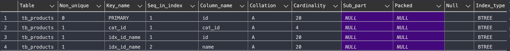
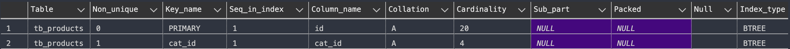

# Index Data in MySQL

Using database ***db_product*** for lab

## 1 - Create INDEX syntax

* Syntax
```sql
CREATE INDEX index_name
ON table_name (column1, column2, ...);
```

* Example: Create index for column ***id***, and ***name*** of table ***tb_product***

```sql
CREATE INDEX idx_id_name ON tb_products(id, name);
```

## 2 - Show INDEX on TABLE

* Show list of indexes on table ***tb_product***
```sql
SHOW INDEX FROM tb_products;
```



## 3 - Drop INDEX on table 

* Drop INDEX have name ***idx_id_name*** on table ***tb_product***

```sql
DROP INDEX idx_id_name ON tb_products;
```

* After that, show all indexes on table ***tb_product***

```sql
SHOW INDEX FROM tb_product;
```


