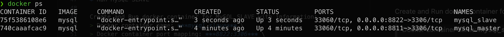
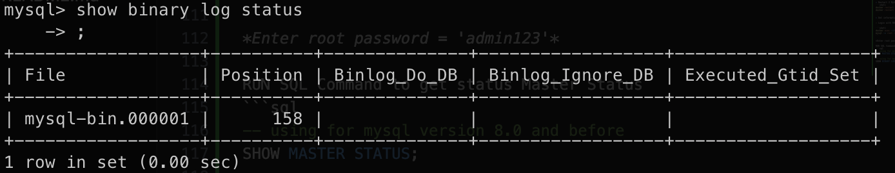

# Replica set in MySQL

using database ***db_product*** 

References:
* Setup for Linux Server: [https://phoenixnap.com/kb/mysql-master-slave-replication](https://phoenixnap.com/kb/mysql-master-slave-replication)

* Setup with MySQL Docker Container: [https://www.linkedin.com/pulse/mysql-master-slave-replication-setup-docker-trong-luong-van-5wbxc/](https://www.linkedin.com/pulse/mysql-master-slave-replication-setup-docker-trong-luong-van-5wbxc/)

## 1 - Method 01: Setup replica set for MySQL Docker Container

* Follow reference: [https://www.linkedin.com/pulse/mysql-master-slave-replication-setup-docker-trong-luong-van-5wbxc/](https://www.linkedin.com/pulse/mysql-master-slave-replication-setup-docker-trong-luong-van-5wbxc/)

### 1.1 - Step 01: Prerequisties

* Create docker network with name ***dnw_mysql_replica_set***

```shell
docker network create dnw_mysql_replica_set
```

* Check docker network to confirm 

```shell
docker network ls
```
* Run MySQL MASTER Docker Container

Check DOCKER IMAGE mysql
```shell
docker image ls
```

Create and Run docker container for MySQL MASTER with information:
> Docker container name: ***mysql_master*** \
> Docker container port mapping: ***8811:3306*** \
> Docker MySQL root user password: ***admin123***

```shell
docker run -d \
    --name mysql_master \
    --network dnw_mysql_replica_set \
    -p 8811:3306 \
    -e MYSQL_ROOT_PASSWORD='admin123'
    mysql
```
* Run MySQL SLAVE 

Create and Run docker container for MySQL SLAVE with information:
> Docker container name: ***mysql_slave*** \
> Docker container port mapping: ***8822:3306*** \
> Docker MySQL root user password: ***admin123***

```shell
docker run -d \
    --name mysql_slave \
    --network dnw_mysql_replica_set \
    -p 8822:3306 \
    -e MYSQL_ROOT_PASSWORD='admin123'
    mysql
```

* Check docker container running


### 1.2 - Step 02: Configure Master/Slave Replication

*copy file my.cnf from master and slave mysql docker to real folder ./lab10/mysql*
* Accessing Container Configuration File 
```shell
docker cp mysql_master:/etc/my.cnf ./lab10/mysql/master
docker cp mysql_slave:/etc/my.cnf ./lab10/mysql/slave
```

* Edit configuration file 

update configuration to ***./lab10/mysql/master*** and ***./lab10/mysql/slave***

master
```lua
log_bin = mysql-bin
server-id=1
```
slave
```lua
log_bin = mysql-bin
server-id=2
```

* Copy configuration file to MySQL Docker Containers

```shell
docker cp ./lab10/mysql/master mysql_master:/etc/my.cnf
docker cp ./lab10/mysql/slave mysql_slave:/etc/my.cnf
```

* Restart 2 MySQL Docker Container
```shell
docker restart mysql_master
docker restart mysql_slave
```

* Get information about the MASTER replication setup

> Login with ROOT user to MySQL Docker Container

```shell
docker exec -it mysql_master bash
mysql -u root -p
```

*Enter root password = 'admin123'*

RUN SQL Command to get status Master Status
```sql
-- using for mysql version 8.0 and before
SHOW MASTER STATUS;

-- using for mysql version 9.0 and after
SHOW BINARY LOG STATUS;
```



> File: mysql-bin.000001 \
> Position: 158

Inspect information of Master Container
```shell
docker inspect mysql_master
```

And get IP Address of Master Container
```json
"IPAddress": "172.23.0.2"
```

* Configuring Slave Replication

Access Slave Container with MySQL CLI
```shell
docker exec -it mysql_slave bash
mysql -u root -o
```

*Enter root password = 'admin123'*

Execute commands to configure ***SLAVE*** replication setting
```sql
-- Using for MySQL 9.0 and before
CHANGE MASTER TO
    MASTER_HOST='172.23.0.2',
    MASTER_PORT=3306,
    MASTER_USER='root',
    MASTER_PASSWORD='admin123',
    MASTER_LOG_FILE='mysql-bin.000001',
    MASTER_LOG_POS=158,
    MASTER_CONNECT_RETRY=60,
    GET_MASTER_PUBLIC_KEY=1;

-- Using for MySQL 9.0 and after
CHANGE REPLICATION SOURCE TO
    SOURCE_HOST='172.23.0.2',
    SOURCE_PORT=3306,
    SOURCE_USER='root',
    SOURCE_PASSWORD='admin123',
    SOURCE_LOG_FILE='mysql-bin.000001',
    SOURCE_LOG_POS=158,
    SOURCE_CONNECT_RETRY=60,
    GET_SOURCE_PUBLIC_KEY=1;

```

Restart Replication in SLAVE
```sql
-- Using for MySQL 8.0 and before
start slave;
-- Using for MySQL 9.0 and after
start REPLICA;
```

After configurating, you can verify status by MySQL CLI
```sql
-- Using for MySQL 8.0 and before
show slave status\G;  

-- Using for MySQL 9.0 and after
show replica status\G;  
```

We check and confirm
- version 8.0:
***Slave_IO_Running: Yes*** and ***Slave_SQL_Running: Yes***
- version 9.0:
 ***Replica_IO_Running: Yes*** and ***Replica_SQL_Running: Yes***

* Verify Replication Setup

Create Database ***user*** on ***Master*** Replication

```sql
--- On Master Database Server
CREATE DATABASE users default charset utf8mb4;
SHOW DATABASES;
```

After that, access to ***Slave*** Database and check all databases.

```sql
SHOW DATABASES;
```

If we see ***users*** database exist in both Master and Slave, done!