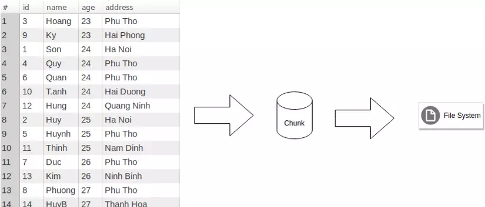
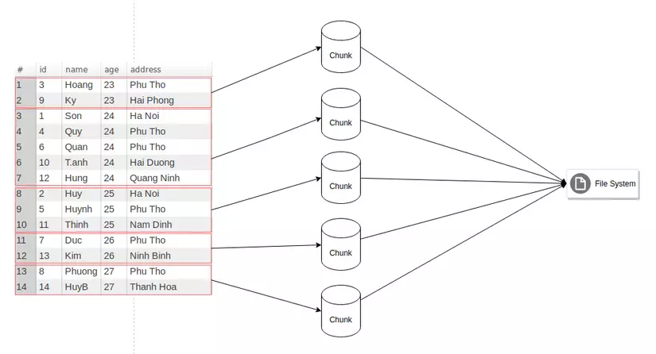
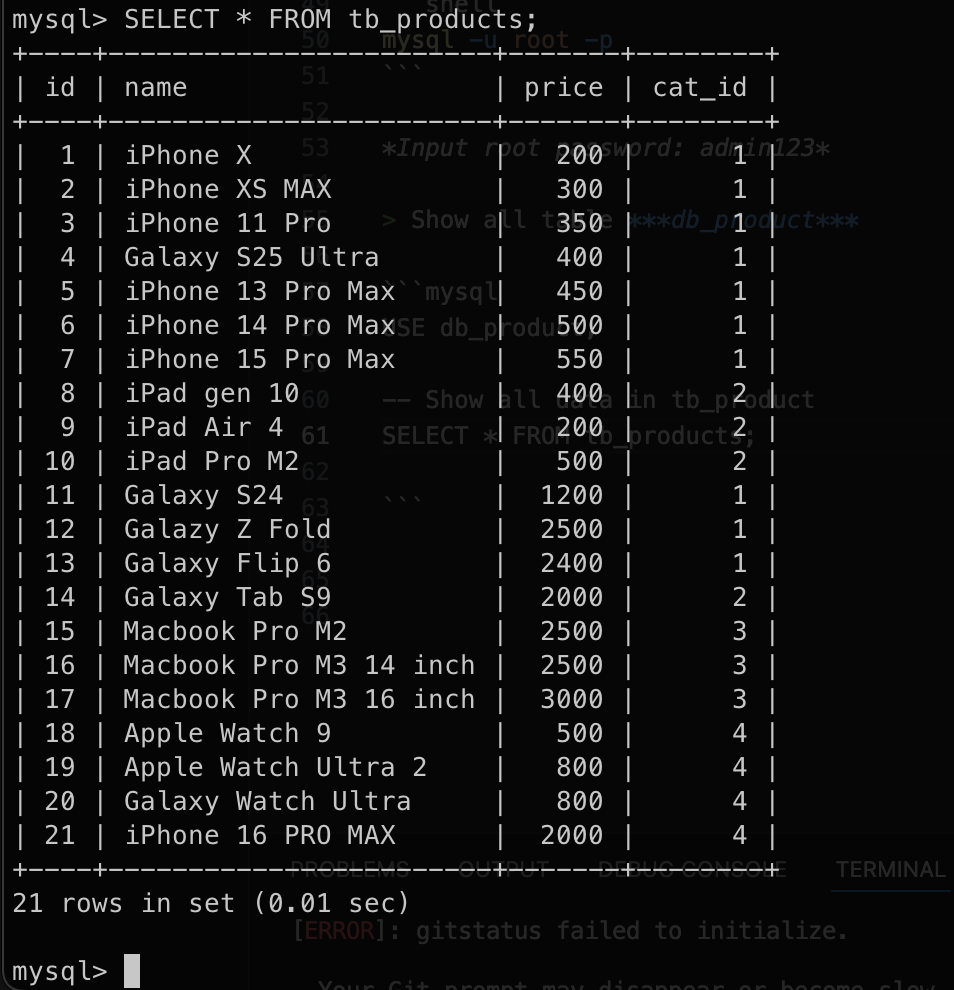
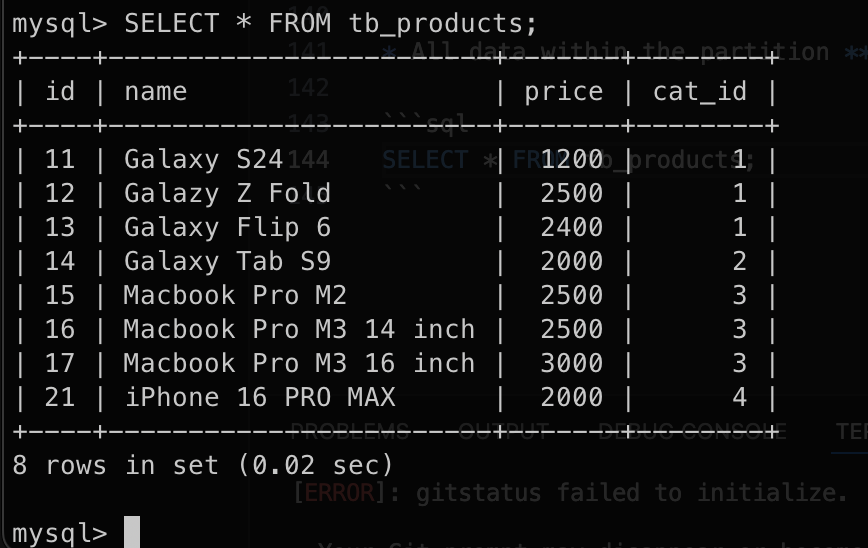

# Partition in MySQL

Using ***db_product*** database for this lab

## 1. Introduction Partiion 

* Before partition



* After partition


* Type of partition
> Range Partition

```sql
mysql> CREATE TABLE sales (no INT NOT NULL, date TIMESTAMP NOT NULL, 
code VARCHAR(15) NOT NULL, amount INT NOT NULL) 
PARTITION  BY RANGE (amount) (
PARTITION p0 VALUES LESS THAN (100), 
PARTITION  p1 VALUES LESS THAN (300), 
PARTITION p2 VALUES LESS THAN (700), 
PARTITION  p3 VALUES LESS THAN (1000)); 
Query OK, 0 rows affected (1.34 sec)
```

> List Partition

```sql
mysql> CREATE TABLE sales (no INT NOT NULL, date TIMESTAMP NOT NULL, 
code VARCHAR(15) NOT NULL, amount INT NOT NULL, saler_id INT NOT NULL) 
PARTITION  BY LIST(saler_id) (
PARTITION pA VALUES IN (1,2,5), 
PARTITION pB VALUES IN (3,4,8), 
PARTITION pC VALUES IN (6,7,9,10)); 
Query OK, 0 rows affected (1.34 sec)
```

> Column Partition

> Hash Partition

> Key Partition

> Subpartition

## 2. Create partition

* Syntax to create partition

```sql
CREATE [TEMPORARY] TABLE [IF NOT EXISTS] tbl_name
(create_definition,...)
[table_options]
[partition_options]
```

or 
```sql
alter table persons partition by key(age) partitions 5;
-- key: là column được chỉ định để phân chia table
-- 5: là số lượng partition mà bạn muốn chia

```

* Now, step by step to create partition for ***db_product***

> Start MySQL Docker Container

```shell
docker start db-mysl
```

> Access to Docker Container 

```shell
docker exec -it db-mysql bash
```

> Acess to MySQL 

```shell
mysql -u root -p
```

*Input root password: admin123*

> Show all table ***db_product***

```mysql
USE db_product;

-- Show all data in tb_product
SELECT * FROM tb_products;

```



> We cannot create partition for table has foreign key. So we need to drop the foreign key before create partition.

```sql
-- Get Foreign Key name
SHOW CREATE TABLE tb_products;
ALTER TABLE tb_products
DROP FOREIGN KEY tb_products_ibfk_1;
```

> Create 2 partition for range of price

```sql
ALTER TABLE tb_products
DROP PRIMARY KEY,
ADD PRIMARY KEY (id, price)
PARTITION BY RANGE(price)(
    PARTITION p_a VALUES LESS THAN (1000),
    PARTITION p_b VALUES LESS THAN MAXVALUE
);
```

> SELECT data for common SELECT CLI 

```sql
SELECT * FROM tb_products;
SELECT * FROM tb_products WHERE price < 1000;
```

## 3. Drop Partition

* Syntax 

```sql
ALTER TABLE <table_name> TRUNCATE PARTITION <partition_name>;
```

```sql
ALTER TABLE tb_products TRUNCATE PARTITION p_a;
```

* All data within the partition ***p_a*** will be lost 

```sql
SELECT * FROM tb_products;
```

